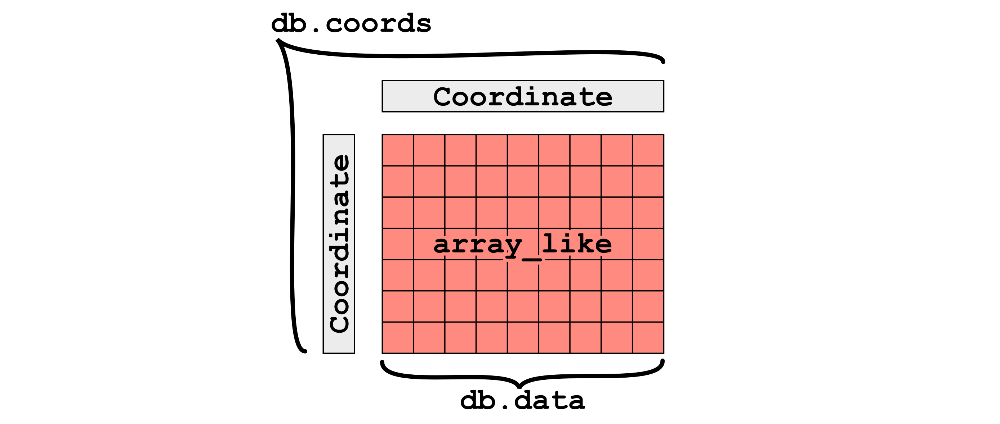

# xdas documentation

Version: 0.1

## Welcome to xdas!

`xdas` is an open source Python library that's used to work with huge labeled
N-dimensional arrays as it is the case in Distributed Acoustic Sensing (DAS). `xdas` API
is highly inspired by the `xarray` project. It provides `xarray` like objects with custom
functionalities that enable to deal with big multi-file netCDF4/HDF5 dataset with
generally one very long dimension (usually time). It provides the classical signal
processing tools to treat time-series that do not fit in memory. It also enables I/O
capabilities with some DAS formats.

## Installing xdas

`xdas` is a pure python package. It can easily be installed with `pip`:

```bash
pip install xdas
```

## How to use xdas

`xdas` must first be imported:

```python
>>> import xdas
```

Data can be fetched from a file (that in this case is a virtual dataset linking
several files):

```python
>>> db = xdas.open_database("path.nc")
>>> db
<xdas.DataBase (time: 398742500, distance: 50000)>
DataSource: 72.5T (float32)
Coordinates:
  * time: 51 tie points from 2021-10-27T15:44:10.722000000 to 2021-12-03T15:45:18.419000000
  * distance: 2 tie points from 0.0 to 204255.9529541732
```

Label-based selection can be done using the `xarray` API.

```python
>>> db = db.sel(
...     time=slice("2021-11-01T00:00:00", "2021-11-01T00:01:00"),
...     distance=slice(10000, 20000),
... )
>>> db
<xdas.DataBase (time: 7500, distance: 2448)>
DataSource: 70.0M (float32)
Coordinates:
  * time: 2 tie points from 2021-11-01T00:00:00.004965486 to 2021-11-01T00:00:59.997391770
  * distance: 2 tie points from 10000.571468065682 to 19997.057735368264
```
Once the selection is small enough to be loader into memory, it can be converted to a
`DataArray` object. This enables the full use of the `xarray` API (e.g., for plotting):

```python
>>> da = db.to_xarray()
>>> da
<xarray.DataArray (time: 7500, distance: 2448)>
array([[-6.93575442e-01, -2.93803036e-01, -1.61099240e-01, ...,
         1.16265193e-01,  2.77099341e-01, -1.40475690e-01],
       [-8.22245598e-01,  3.20922919e-02,  6.98425621e-02, ...,
         2.69569069e-01,  5.25256395e-02, -3.80651891e-01],
       [-3.28596473e-01, -5.87357283e-02,  2.23071966e-02, ...,
        -8.57351646e-02, -1.54875994e-01,  1.33143902e-01],
       ...,
       [-2.81142759e+00, -1.95501876e+00, -3.04735589e+00, ...,
         2.41583481e-01, -4.05728817e-04, -3.37809414e-01],
       [-2.90901971e+00, -2.24321461e+00, -3.02241182e+00, ...,
        -3.86926308e-02, -4.36988175e-02, -7.98450038e-02],
       [-2.87361526e+00, -2.46662259e+00, -3.10725236e+00, ...,
        -1.23963416e-01, -5.09915948e-01, -5.64823151e-02]], dtype=float32)
Coordinates:
  * time      (time) datetime64[ns] 2021-11-01T00:00:00.004965486 ... 2021-11...
  * distance  (distance) float64 1e+04 1e+04 1.001e+04 ... 1.999e+04 2e+04
```


## Data structure

### Database



```{eval-rst}
.. autoclass:: xdas.Database
   :members:
```

### Coordinate

Because data is generally sampled with a constant sampling rate/resolution keeping the 
corresponding value for each index as a dense array is inefficient. In `xdas`
coordinates are saved using the 
[CF convention][CF]. Only a few tie points are kept and intermediate values are retrieved
by linear interpolation. Discontinuities are marked by two consecutive tie points.


```{eval-rst}
.. autoclass:: xdas.Coordinate
   :members:
```

[CF]: <http://cfconventions.org/Data/cf-conventions/cf-conventions-1.10/cf-conventions.html#compression-by-coordinate-subsampling>

### DataCollection
```{eval-rst}
.. autoclass:: xdas.DataCollection
   :members:
```
